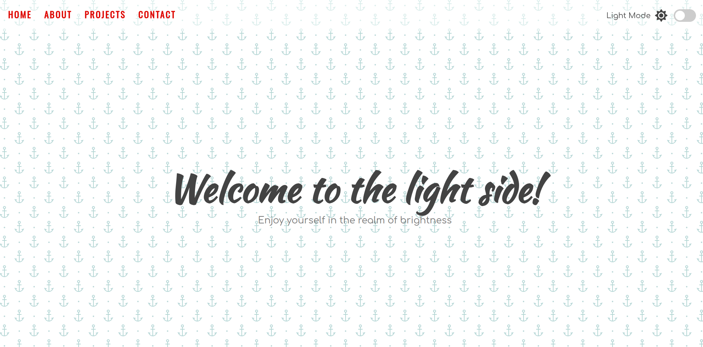

<div align="center">

# 🌗 Light Dark Mode

   

_A hands-on project to learn how dark theme works and how to apply it following Material Design 3 guidelines._

</div>

## 📖 About

**Light Dark Mode** is a project built to understand how dark theme works in modern applications and how to properly implement it. Using **Material Design 3** by Google as a design reference, the project covers all the guidelines for adjusting colors, typography, and elements to support both light and dark modes.

The page is structured in multiple sections, each one designed to practice how colors, SVGs, and components respond to theme switching.

## ✨ Features

- Toggle between light and dark theme via checkbox
- Dynamic SVGs that adapt to the active theme
- Multiple sections to demonstrate color switching across different elements
- Dark theme implementation following Material Design 3 guidelines

## 🎬 Demo



⛓️‍💥 [Live Demo](https://pmbfsa.github.io/light-dark-mode/)

## 🚀 Getting Started

### Prerequisites

- [Node.js](https://nodejs.org/)
- [npm](https://www.npmjs.com/)

### Installation

1. Clone the repository:

```bash
git clone https://github.com/pmbfsa/light-dark-mode.git
```

2. Navigate to the project directory:

```bash
cd light-dark-mode
```

3. Install dependencies:

```bash
npm install
```

4. Start the development server:

```bash
npm run dev
```

5. To build for production:

```bash
npm run build
```

## 🛠️ Built With

| Technology                                                            | Description                                      |
| --------------------------------------------------------------------- | ------------------------------------------------ |
| [HTML5](https://developer.mozilla.org/en-US/docs/Web/HTML)            | Page structure and markup                        |
| [Sass](https://sass-lang.com/)                                        | CSS preprocessor for styling and theme variables |
| [JavaScript](https://developer.mozilla.org/en-US/docs/Web/JavaScript) | Theme toggle logic                               |
| [Vite](https://vitejs.dev/)                                           | Build tool and development server                |
| [Material Design 3](https://m3.material.io/)                          | Design guidelines for dark theme implementation  |
| [FontAwesome](https://fontawesome.com/)                               | Icon library                                     |

## 📁 Project Structure

```
light-dark-mode/
├── docs/                   # GitHub Pages published build
├── public/
│   ├── svgs/               # SVG images used in the project
│   └── favicon.png
├── src/
│   ├── assets/
│   │   └── fonts/          # FontAwesome font files
│   ├── sass/
│   │   ├── fontawesome/    # FontAwesome Sass files
│   │   └── style.scss      # Main stylesheet
│   └── main.js             # Main JavaScript file
├── index.html
├── package.json
├── screenshot.png          # Project screenshot
└── vite.config.js
```

## 📄 License

This project is licensed under the **GNU General Public License v3.0**. See the [LICENSE](LICENSE) file for details.
